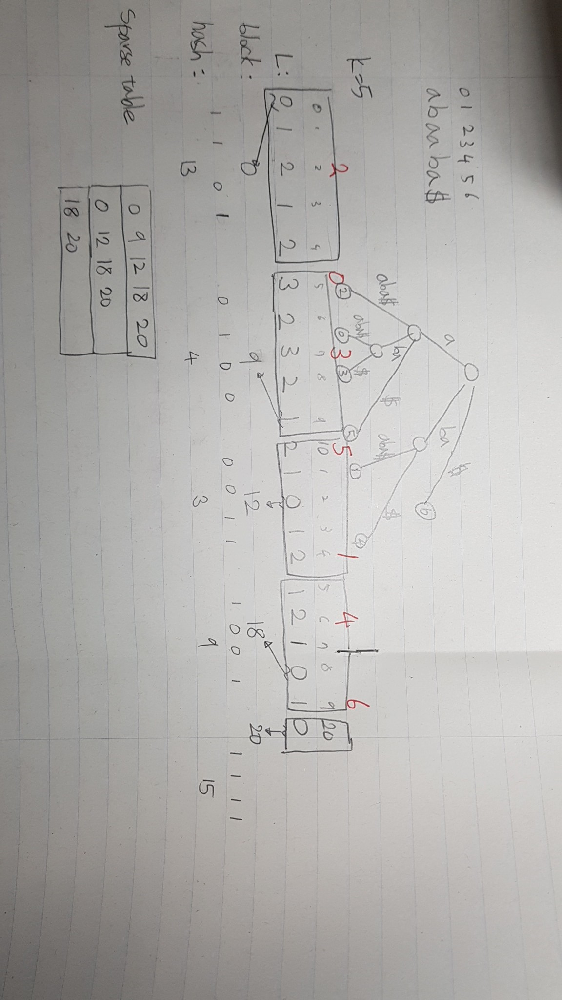
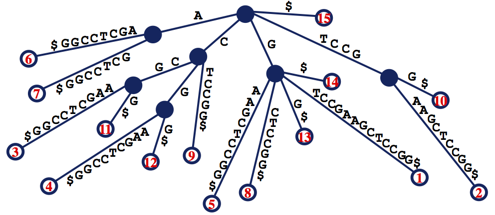
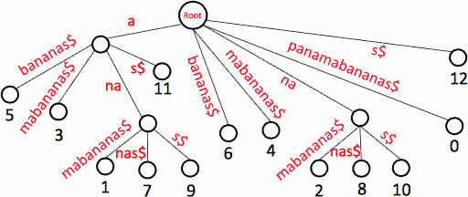

# <O(N), O(1)> LCA query 
 Build a suffix tree of a given string. 
 And then compute a longest prefix of two suffixes in a given string. 
 Using sparse table and precomputed tables,
 we can do this in O(1) per a query with O(N) preprocessing time.
[LCA Problem Revisited](http://www.ics.uci.edu/~eppstein/261/BenFar-LCA-00.pdf) 

## How to run
 Simply `make` in a root directory and `./lca examplestring$`.

 String must ends with a character that doesn't appear anywhere in a string.

## Tests
 Test stirngs are located in a test directory.
 Run `sh test/test01.sh` to run a test.

 * test01.sh

   
 
 * test02.sh
   
   

 * test03.sh
 
   
